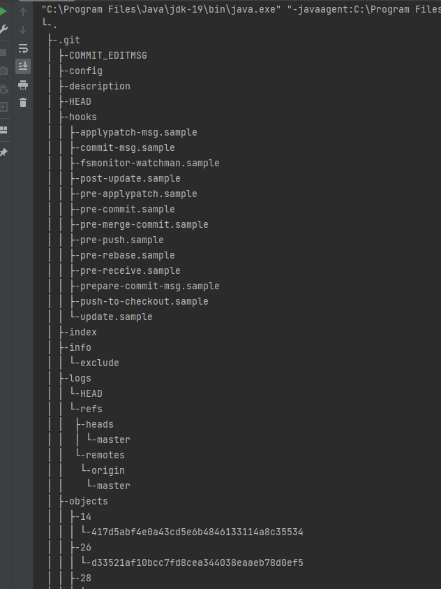
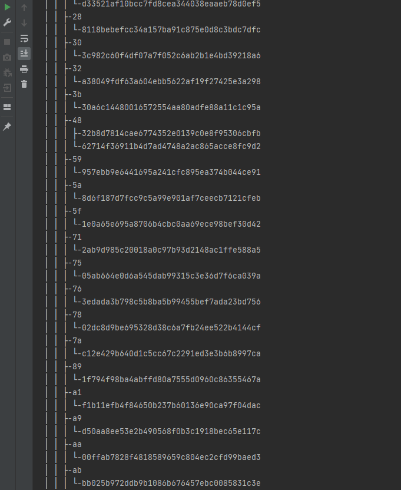
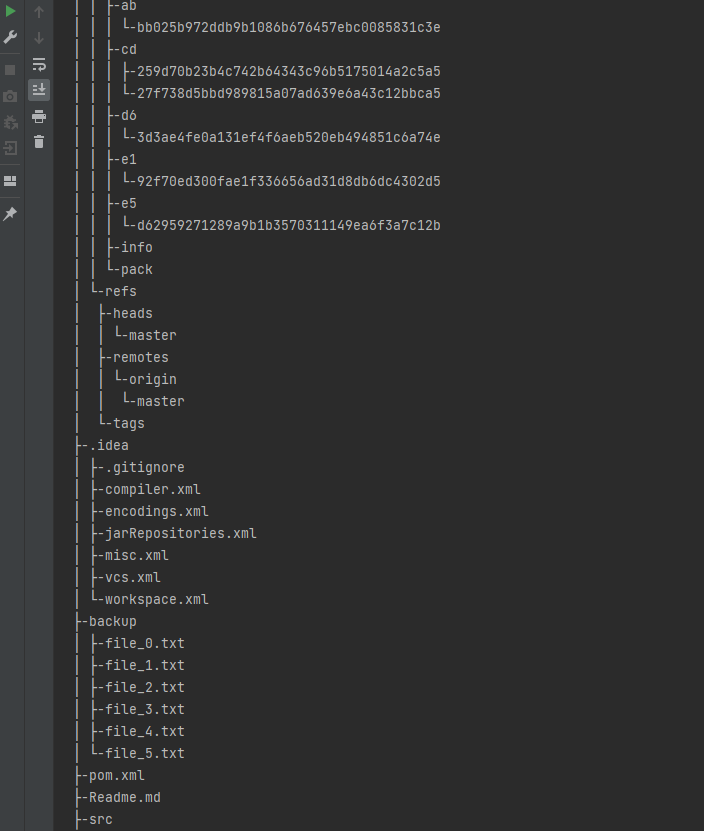
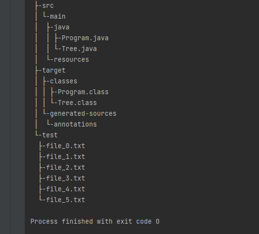

## Домашнее задание 5

1. Написать функцию, создающую резервную копию всех файлов в директории во вновь созданную папку ./backup
2. Доработайте класс Tree и метод print который мы разработали на семинаре.
Ваш метод должен распечатать полноценное дерево директорий и файлов относительно корневой директории.

### Решение
1. в файле Program
2. в файле Tree

* Скрины

